# Ignite 2022 react-native

## Class 1 - Imhere ([Folder](./react-native-2022/aulas/1-imhere/))

## Challenge 1 - Todo App ([Folder](./react-native-2022/desafios/1-todo/))

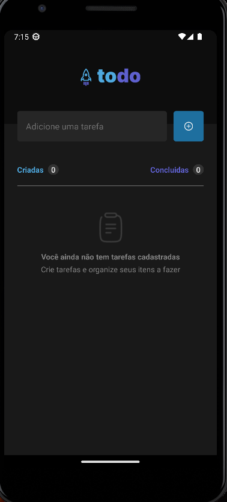
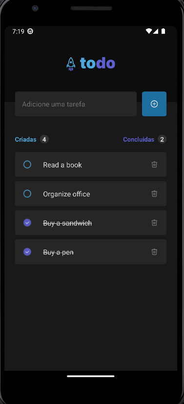

## Class 2 - Ignite Teams ([Folder](./react-native-2022/aulas/2-igniteteams/))

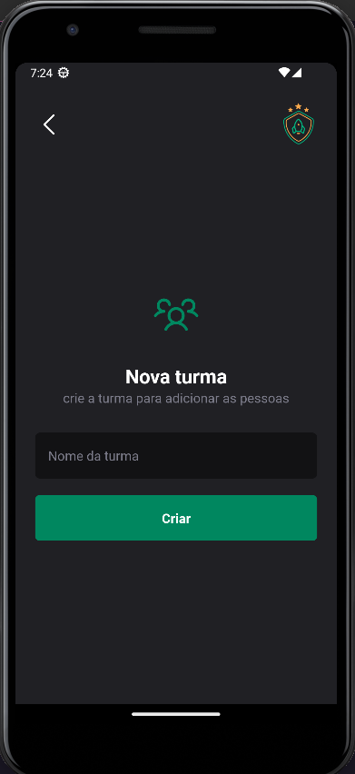
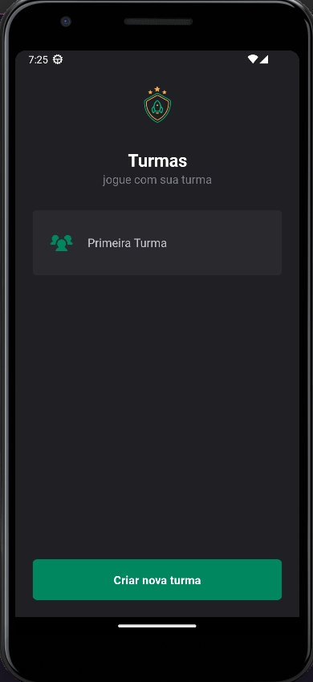
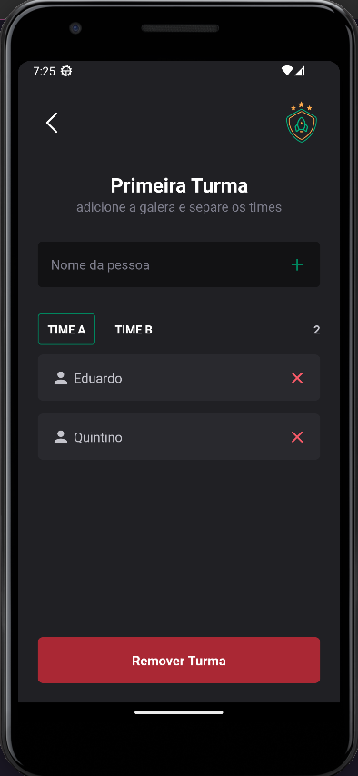

## Challenge 2 - Daily Diet ([Folder](./react-native-2022/desafios/2-dailydiet/))

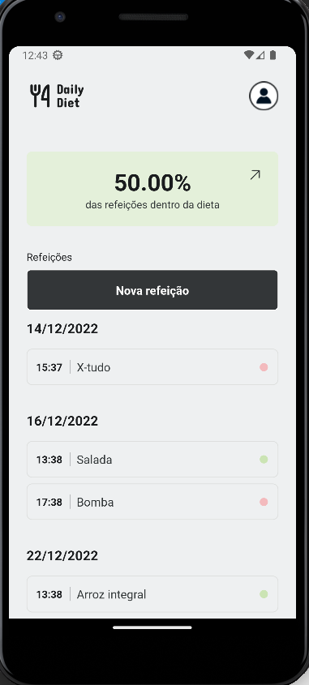
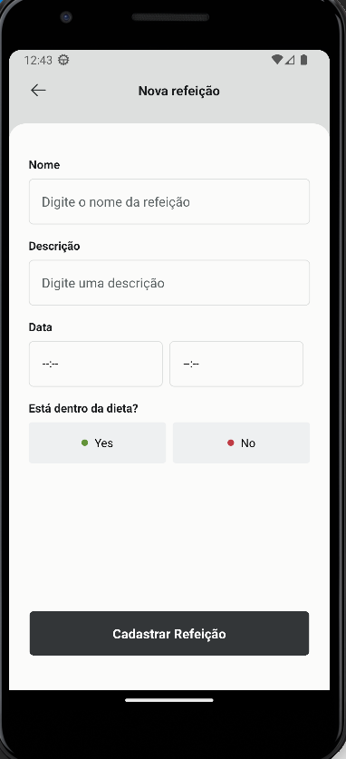
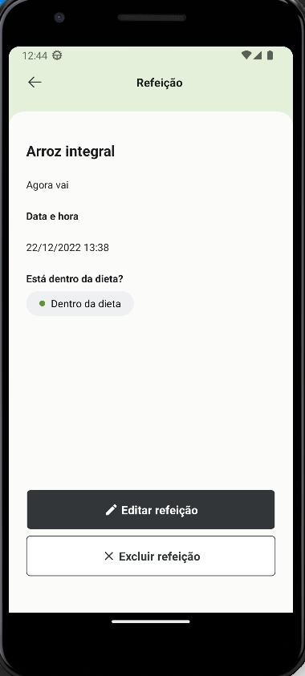
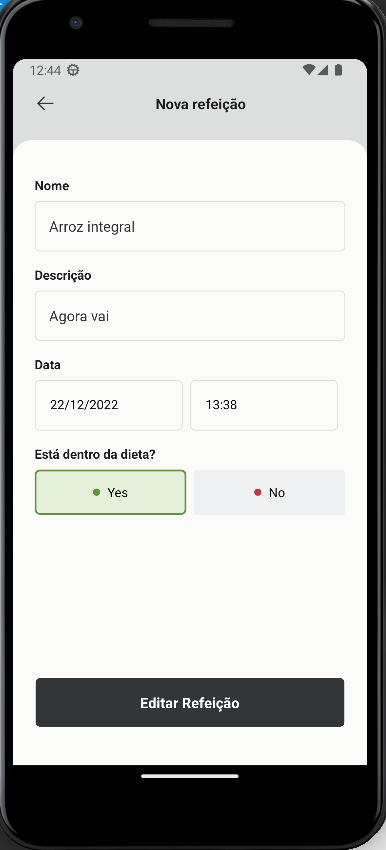
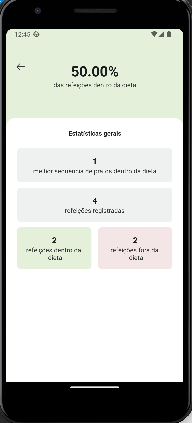

# Ignite 2021 react-native

## Conceitos React Native 2021

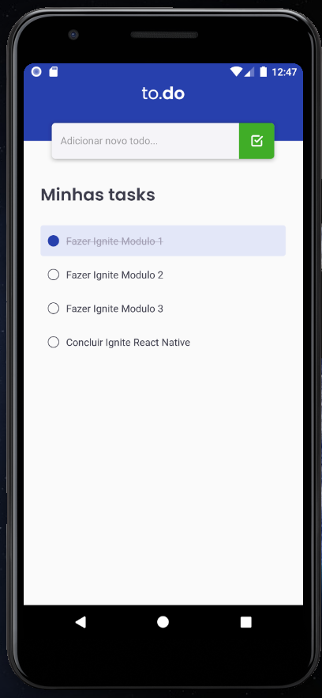
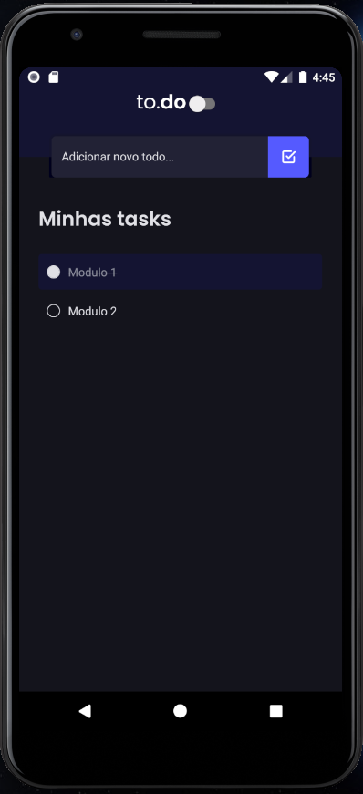
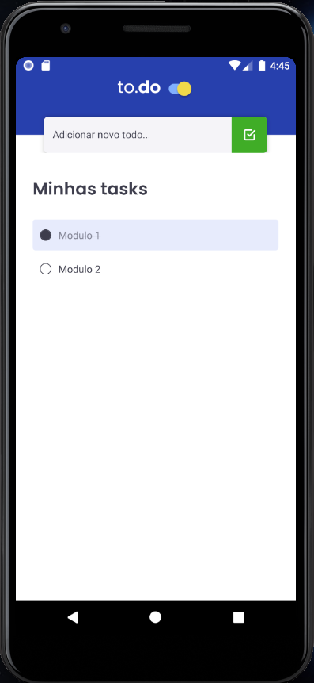

## Resoluções

Failed to install the app. Make sure you have the Android development environment set up: https://reactnative.dev/docs/environment-setup.

"I was receiving this error message when running react-native run-android.

When I ran cd android && ./gradlew clean I was getting permission errors also.

I ran chmod +x gradlew and it started working"
