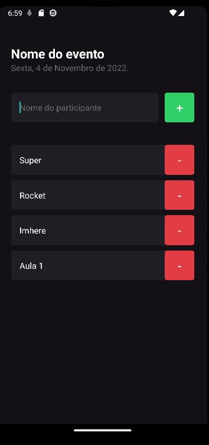

# Aula - Expo ImHere

Criar projeto

```console
expo init imhere --npm
```

Para iniciar

```console
expo start
```

Criado com Bare with typescript

ScrollView -> Carrega todos os componentes
FlatList -> Não carrega todos, apenas os que estão em tela



```console

```
